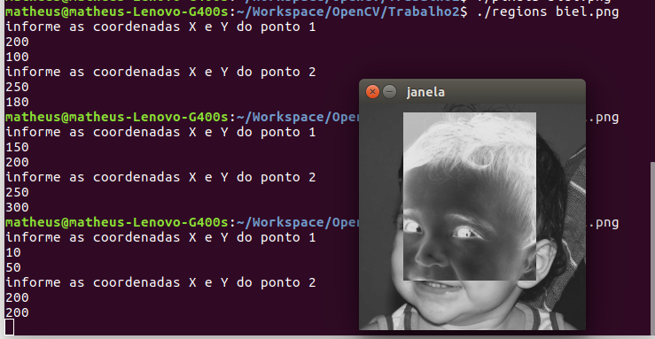
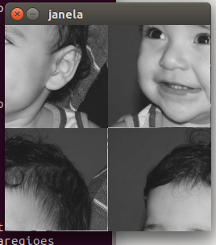
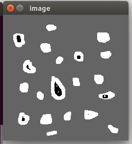
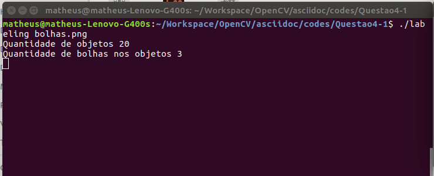
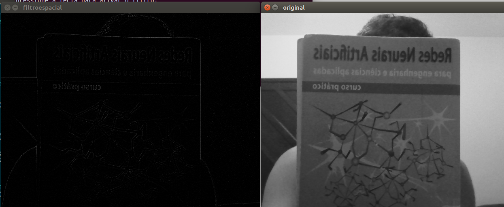
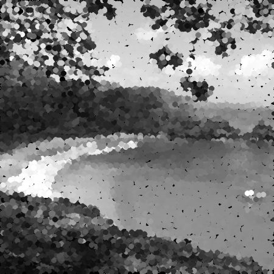
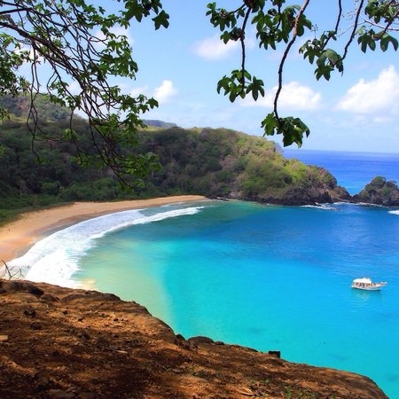

= Processamento Digital de Imagens
Doc Writer <Matheus Pessoa - matheus.pessoa16@gmail.com, Genilson Filho - genilson974@gmail.com>
:source-highlighter: coderay
:listing-caption: Listing
:toc: left

NOTE: Implementações dos Códigos da disciplina PDI.
Todos os códigos são livres.

== Código "Troca Regiões" e "Negativo"

A primeira parte da atividade foi implementar dois códigos que pudessem mostrar o negativo de uma região selecionada
na imagem e que trocasse os quadrantes de posição;

.Resultado do "Negativo"

=== Código Negativo
[source, cpp]
----
include::codes/Trabalho2/regions.cpp[]
----

.Resultado do "Troca Regiões"

=== Código Troca Regiões
[source, cpp]
----
include::codes/Trabalho2/trocaregioes.cpp[]
----

=== Código Labeling
[source, cpp]
----
include::codes/questao4/labeling.cpp[]
----

.Resultado do "Labeling"

== Histogramas (Equalização e Motion Detector)

Os códigos aqui não estão apresentando a saída pois são streams de vídeos da webcam. Porém, pode-se compilar os códigos usando
o arquivo Makefile.

No código de equalização bastou usar a função _equalizeHist()_ da biblioteca OpenCV passando as matrizes de fonte e de destino.

=== Código Equalização
[source, cpp]
----
include::codes/histograma/equalizacao.cpp[]
----

No _motion detector_ dois histogramas são comparados a todo instante para determinar se há diferenças entre eles. Dentro do loop foi inserido um _delay()_ na forma de um laço contado, de forma que houvesse um tempo entre o cálculo dos dois histogramas (permitindo verificar se houve mudanças entre o primeiro e o segundo).
Após isso, foi usada a função _compareHist()_ para saber o grau de correlação entre os dois histogramas calculados. Apenas um canal foi usado.

=== Código Motion Detector
[source, cpp]
----
include::codes/histograma/motiondetector.cpp[]
----

=== Código Filtro Espacial I

O resultado do filtro espacial abaixo é apenas do Laplaciano. Entretando, para ver os demais filtros, basta complilar o código
e executá-los.

[source, cpp]
----
include::codes/questao6/filtroespacial.cpp[]
----

.Resultado do "Filtro Espacial" para o Laplaciano

=== Código Pontilhismo usando Algoritmo de Canny

Nessa prática foram usadas duas técnicas para construir a imagem abaixo. Primeiro, foi usado o algoritmo de detecção de bordas de Canny, para selecionar a quantidade de bordas na imagem da praia. Um trackbar permite modificar o nível de filtragem do algoritmo.
Após isso, usando apenas as bordas existentes na imagem e o limiar ajustado pelo trackbar, foram desenhados círculos nas bordas detectadas. O raio dos círculos é calculado usando alguns fatores de escala com o valor do trackbar.

[source, cpp]
----
include::codes/pontilhismo-canny/pontilhismo.cpp[]
----
---
[.left]
.Resultado do Pontilhismo com Canny

[.left]
.Imagem original

---
The page to my repository is https://nerdroid.github.io[Github Nerdroid]
